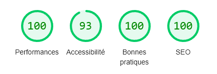

# Mon CV en ligne

J'ai appris que certains développeurs créaient leur CV sous forme de site à l'aide de [JSON Resume](https://jsonresume.org/). J'ai donc jeté un œil, mais le fait d'être dépendant d'un outil pour construire son CV m'agaçait.

J'ai donc pris pour modèle le thème [Even](https://www.npmjs.com/package/jsonresume-theme-even) créé spécialement pour JSON Resume et j'ai entièrement créé mon CV à la main en ajoutant quelques interactions et animations au passage.
## Stack Technique

**Frontend:** Next JS, TailwindCSS, NextUI, Framer Motion

## Résultats Lighthouse

## Production

[Voir le site](https://sofiane-rahmani-resume.vercel.app/)

